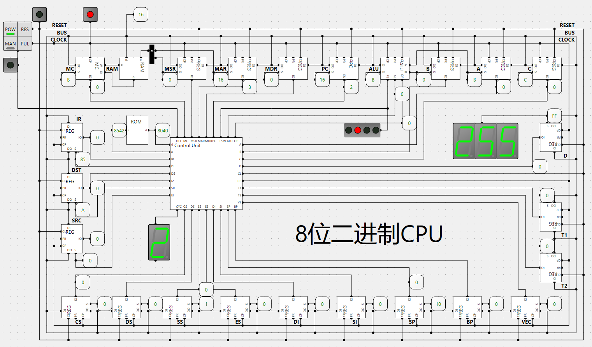

# 计算机体系结构

## 一个8位二进制CPU的设计和实现

## x86 汇编语言

[x86_assembly](./x86_assembly/)

## 参考

- [computer](https://github.com/StevenBaby/computer)
- 《编码：隐匿在计算机软硬件背后的语言》
- 王爽 - 汇编语言
- 李忠 & 王晓波 & 余洁 - X86汇编语言
- Richard Blum - 汇编语言程序设计
- Stephen G. Kochan - Programming in C
- P.J.Plauger - The Standard C Library