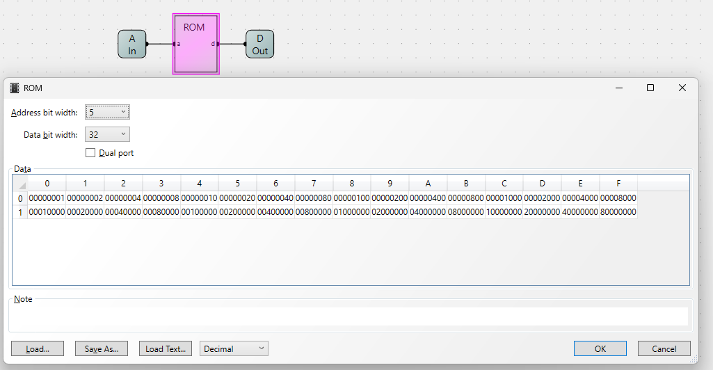
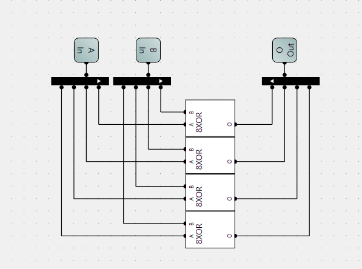
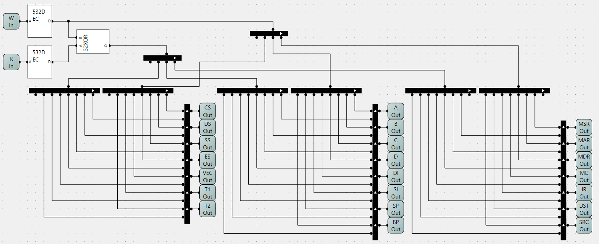
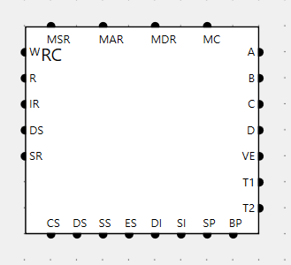
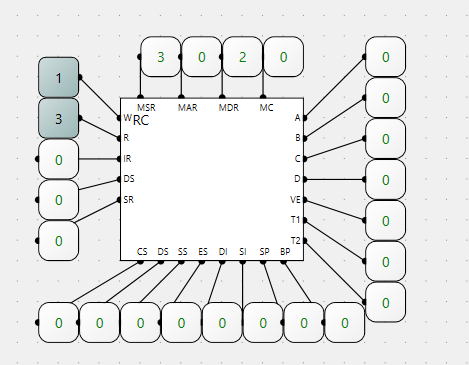

## 寄存器控制器RC

### 寄存器列表

- MSR寄存器：Memory Segment Register，存储器段寄存器。
- MAR寄存器：Memory Address Register，存储器地址寄存器。
- MDR寄存器：Memory Date Register， 存储器数据寄存器
- IR寄存器：Instruction Register，指令寄存器。
- DST寄存器：Destination Register，目标操作数寄存器。
- SRC寄存器：Source Register，源操作数寄存器。
- A寄存器
- B寄存器
- C寄存器
- D寄存器
- 指针及变址寄存器
  - DI寄存器：Destination Index，目的变址寄存器，与DS寄存器连用,指向数据存放位置。
  - SI寄存器：Source Index，源变址寄存器，与DS寄存器连用,指向数据读取位置。
  - SP寄存器：Stack Point，栈指针寄存器，始终指向栈顶的位置, 与SS寄存器一起组成栈顶数据的物理地址。
  - BP寄存器：Base Point, 基址指针寄存器，通常用于指向栈帧基地址。
- 段寄存器
  - CS寄存器：Code Segment,代码段寄存器，存放当前程序的指令代码。
  - DS寄存器：Data Segment,数据段寄存器，存放程序所涉及的源数据或结果。
  - SS寄存器：Stack Segment,栈段寄存器，用于存储栈段的起始地址。
  - ES寄存器：Extra Segment,附加段寄存器，辅助数据区, 存放串或其他数据。
- VEC寄存器：
- T1寄存器：临时寄存器1.
- T2寄存器：临时寄存器2。

### 532译码器电路实现

使用ROM方式实现(32位数中只有一位为1，表示选中)



使用python程序生成`532decoder.bin`后装载到ROM里：

```python
import os

dirname = os.path.dirname(__file__)
filename = os.path.join(dirname, '532decoder.bin')

with open(filename, 'wb') as file:
    for var in range(32):
        value = 1 << var
        result = value.to_bytes(4, byteorder='little')
        file.write(result)
```

### 32位异或门



### RC电路实现



组件管脚顺序：


### RC电路测试


W=1，表示第一个寄存器写，为11(3)。 R=3，表示第3个寄存器读，为10(2)。

真值表如下：

|输入|输入|输出|输出|输出|
|-|-|-|-|-|
|**R**|**W**|**CS**|**WE**|**功能**|
|1|0|1|0|读|
|0|1|1|1|写|
|1|1|0|1|无效|
|0|0|0|0|无效|