## 基本门电路

### 与门

#### 继电器实现


符号表示形式如下：


#### 真值表

| AND | 0 | 1 |
| - | - | - |
| 0 | 0 | 0 |
| 1 | 0 | 1 |


### 或门

#### 继电器实现


符号表示形式如下：


#### 真值表

| OR | 0 | 1 |
| - | - | - |
| 0 | 0 | 1 |
| 1 | 1 | 1 |

### 反相器

#### 继电器实现


符号表示形式如下：


### 或非门

#### 继电器实现


符号表示形式如下：


#### 真值表

| NOR | 0 | 1 |
| - | - | - |
| 0 | 1 | 0 |
| 1 | 0 | 0 |

### 与非门

#### 继电器实现


符号表示形式如下：


#### 真值表

| NAND | 0 | 1 |
| - | - | - |
| 0 | 1 | 1 |
| 1 | 1 | 0 |

### 四种不同逻辑门关系如下


### 摩根定律可以简单地表示为如下形式：

$$
\begin{align*}
    \overline{A} \times \overline{B} &= \overline{A+B} \\
    \overline{A} +      \overline{B} &= \overline{A \times B} 
\end{align*}
$$

## 二进制加法器

一对二进制数相加的结果中具有两个数码，其中一位叫做加法位（sum bit），另一位则叫做进位位（carry bit，例如，1加1等于0，进位为1）

- 表示加法的表格：

    |+加法|0|1|
    |-|-|-|
    |0|0|1|
    |1|1|0|

- 表示进位的表格：

    |+进位|0|1|
    |-|-|-|
    |0|0|0|
    |1|0|1| 

### 异或门

符号表示形式如下：

电路图如下：


#### 电路实现


### 半加器

符号表示形式如下：

电路图如下：


#### 电路实现


### 全加器

符号表示形式如下：

电路图如下：


#### 电路实现


以下表格总结了全加法器所有可能的输入组合以及对应的输出结果。

|输入A|输入B|进位输出|加和输出|进位输出|
|-|-|-|-|-|
|0|0|0|0|0|
|0|1|0|1|0|
|1|0|0|1|0|
|1|1|0|0|1|
|0|0|1|1|0|
|0|1|1|0|1|
|1|0|1|0|1|
|1|1|1|1|1|

### 8位行波进位（ripple carry）全加器

电路图如下：


#### 电路实现


## 如何实现减法

### 求补器

符号表示形式如下：

电路图如下：


#### 电路实现


### 减法电路实现


## 触发器

### R-S触发器
电路图如下：


#### 电路实现


#### R-S触发器真值表

| 输入 | 输入 | 输出 | 输出 |
|------|------|------|------|
| **S** | **R** | **Q** | **Q̅** |
| 1    | 0    | 1    | 0    |
| 0    | 1    | 0    | 1    |
| 0    | 0    | Q    | Q̅   |
| 1    | 1    | 禁止 | 禁止 |


### 具有保持位的R-S触发器
电路图如下：


#### 电路实现


#### 具有保持位R-S触发器真值表

| **数据** | **保持位** | **Q** |
|------|------|------|
| 0    | 1    | 0    | 
| 1    | 1    | 1    | 
| X    | 0    | Q    |

### 电平触发的D型触发器
电路图如下：


#### 电路实现


#### 电平触发的D型触发器真值表

| 输入 | 输入 | 输出 | 输出 |
|------|------|------|------|
| **D** | **Clk** | **Q** | **Q̅** |
| 0    | 1    | 0    | 1    |
| 1    | 1    | 1    | 0    |
| X    | 0    | Q    | Q̅   |

### 边沿触发的D型触发器
电路图如下：


#### 电路实现


#### 边沿触发的D型触发器真值表

| 输入 | 输入 | 输出 | 输出 |
|------|------|------|------|
| **D** | **Clk** | **Q** | **Q̅** |
| 0    | ↑    | 0    | 1    |
| 1    | ↑    | 1    | 0    |
| X    | 0    | Q    | Q̅    |

#### 边沿触发的D型触发器（带有清除和预设）

#### 电路实现


#### 边沿触发的D型触发器真值表

| 输入 | 输入 | 输入 | 输入 | 输出 | 输出 |
|------|------|------|------|------|------|
| **Pre** | **Clr** | **D** | **Clk** | **Q** | **Q̅** |
| 1   | 0   | X    | X    | 1    | 0    |
| 0   | 1   | X    | X    | 0    | 1    |
| 0   | 0   | 0    | ↑    | 0    | 1    |
| 0   | 0   | 1    | ↑    | 1    | 0    |
| 0   | 0   | X    | 0    | Q    | Q̅    |

## 计数器

### 分频器
电路图如下：


#### 电路实现


### 8位行波计数器
电路图如下：


#### 电路实现


## 寄存器 (edge-triggered）

### 三态门（Three-State Gate）

#### 电路实现


### 8位锁存器
电路图如下：


#### 电路实现


### 8位寄存器

#### 电路实现


## 存储器

### 三八译码器

电路图如下：
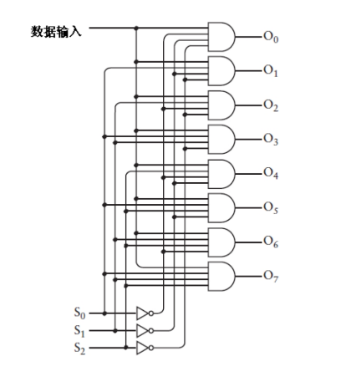

电路实现:
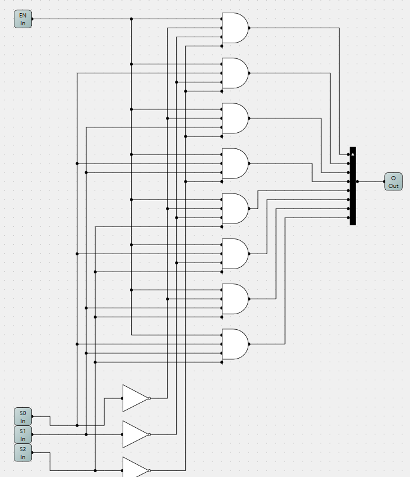

#### 三八译码器真值表

| 输入 | 输入 | 输入 | 输出 | 输出 | 输出 | 输出 | 输出 | 输出 | 输出 | 输出 |
|------|------|------|------|------|------|------|------|------|------|------|
| **S₂** | **S₁** | **S₀** | **O₇** | **O₆** | **O₅** | **O₄** | **O₃** | **O₂** | **O₁** | **O₀** |
| 0      | 0      | 0      | 0      | 0      | 0      | 0      | 0      | 0      | 0      | Data   |
| 0      | 0      | 1      | 0      | 0      | 0      | 0      | 0      | 0      | Data   | 0      |
| 0      | 1      | 0      | 0      | 0      | 0      | 0      | 0      | Data   | 0      | 0      |
| 0      | 1      | 1      | 0      | 0      | 0      | 0      | Data   | 0      | 0      | 0      |
| 1      | 0      | 0      | 0      | 0      | 0      | Data   | 0      | 0      | 0      | 0      |
| 1      | 0      | 1      | 0      | 0      | Data   | 0      | 0      | 0      | 0      | 0      |
| 1      | 1      | 0      | 0      | Data   | 0      | 0      | 0      | 0      | 0      | 0      |
| 1      | 1      | 1      | Data   | 0      | 0      | 0      | 0      | 0      | 0      | 0      |

### 8x1byte存储器

8x1byte存储器电路实现如下：
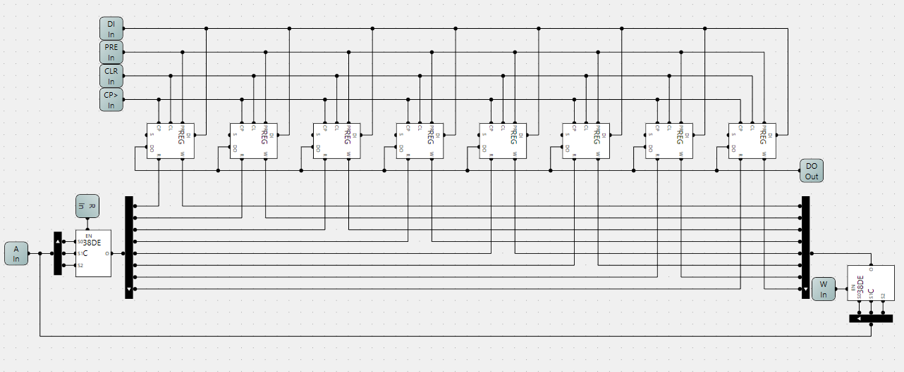

### 8x2byte存储器 (按位扩展)

8x2byte存储器电路实现如下：
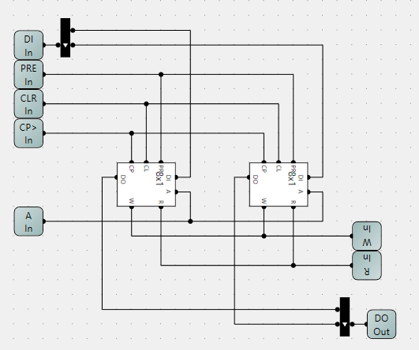

### 1-2译码器

1-2译码器电路实现如下：
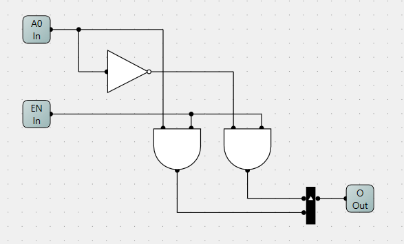

### 16x1Hbyte存储器 (按字扩展，高位交叉编址)

16x1Hbyte存储器电路实现如下：
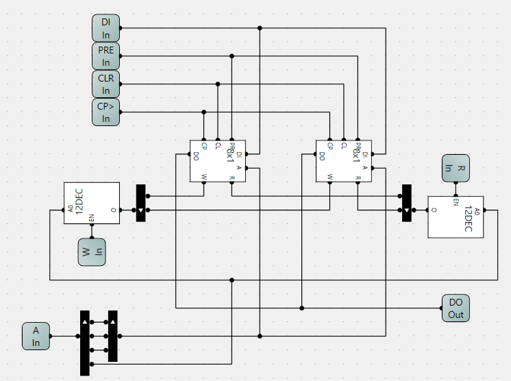

### 16x1Lbyte存储器 (低位交叉编址)

16x1Lbyte存储器电路实现如下：
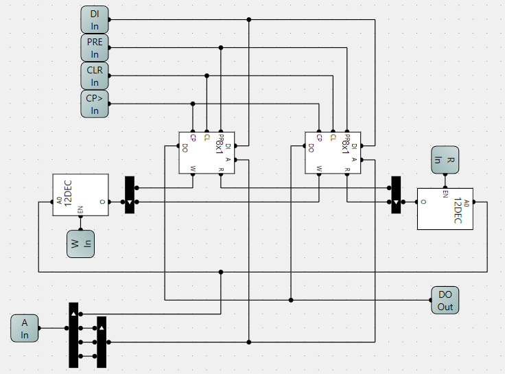

## 半自动ALU

电路实现:
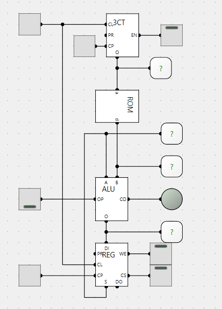

## 全自动ALU

电路实现:
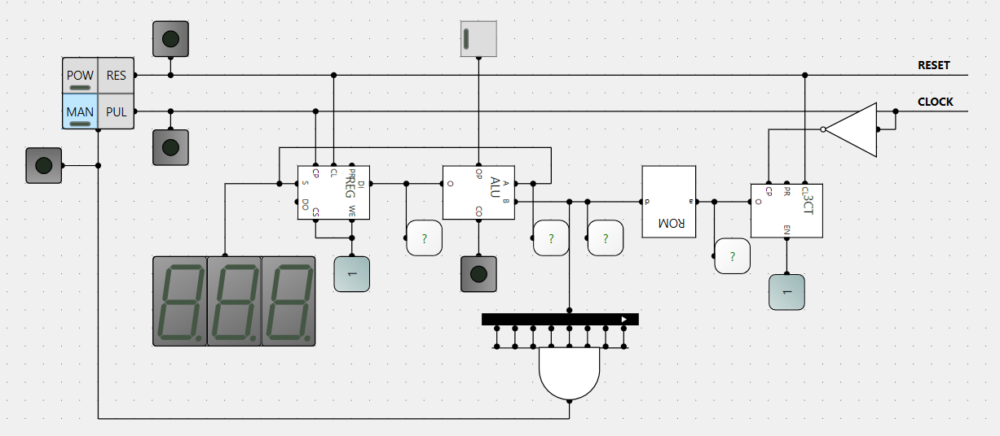

## 程序计数器和内存控制器

### 程序计数器

电路实现:
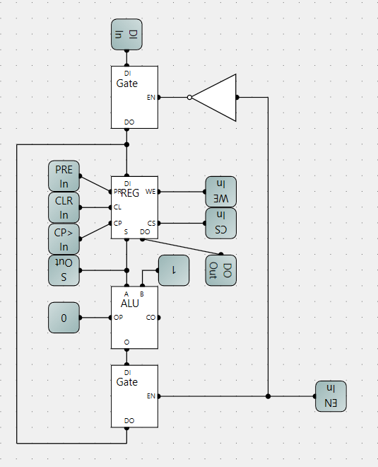

### 内存控制器

电路实现:
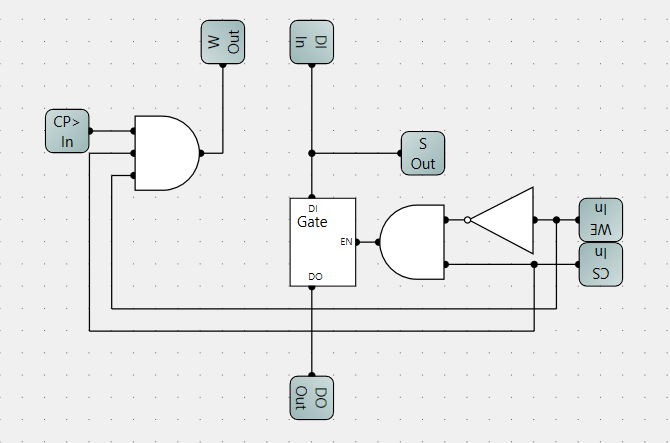


### 程序计数器和内存控制器测试

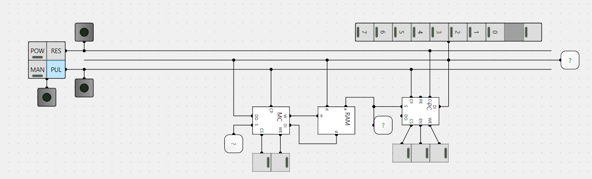

## 微程序控制

电路实现:
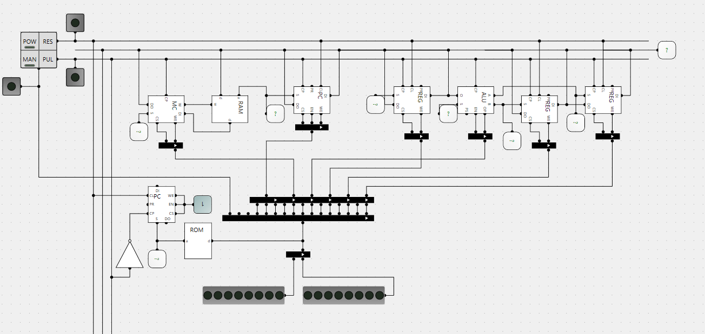

`ins.py`相关代码：

```python
import os

dirname = os.path.dirname(__file__)
filename = os.path.join(dirname, 'ins.bin')

WE_A = 2 ** 0  # 1
CS_A = 2 ** 1  # 1X

WE_B = 2 ** 2  # 1XX
CS_B = 2 ** 3

WE_C = 2 ** 4
CS_C = 2 ** 5

ALU_ADD = 0
ALU_SUB = 2 ** 6
ALU_OUT = 2 ** 7

WE_M = 2 ** 8
CS_M = 2 ** 9

WE_PC = 2 ** 10
EN_PC = 2 ** 11
CS_PC = 2 ** 12

HLT = 2 ** 15

micro = [
    CS_M | CS_A | WE_A | WE_PC | EN_PC | CS_PC,
    CS_M | CS_B | WE_B | WE_PC | EN_PC | CS_PC,
    ALU_OUT | CS_C | WE_C,              # 如何保存减法值到寄存器C：ALU_SUB | ALU_OUT | CS_C | WE_C
    CS_C | CS_M | WE_M | WE_PC | EN_PC | CS_PC,
    HLT,
]

with open(filename, 'wb') as file:
    for value in micro:
        result = value.to_bytes(2, byteorder='little')
        file.write(result)
        print(value, result)

print('Finish compile!!!')
```

## 逻辑运算

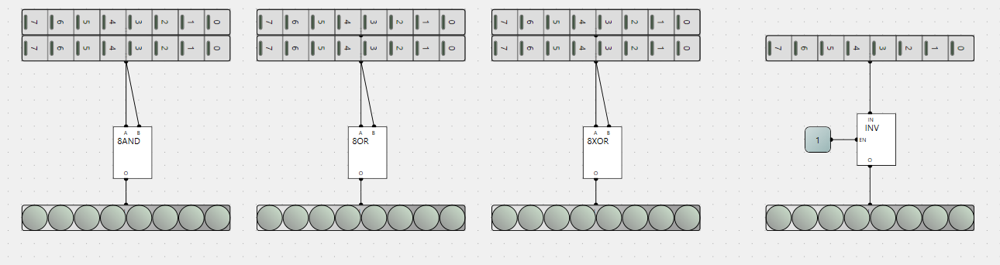

## 程序状态字

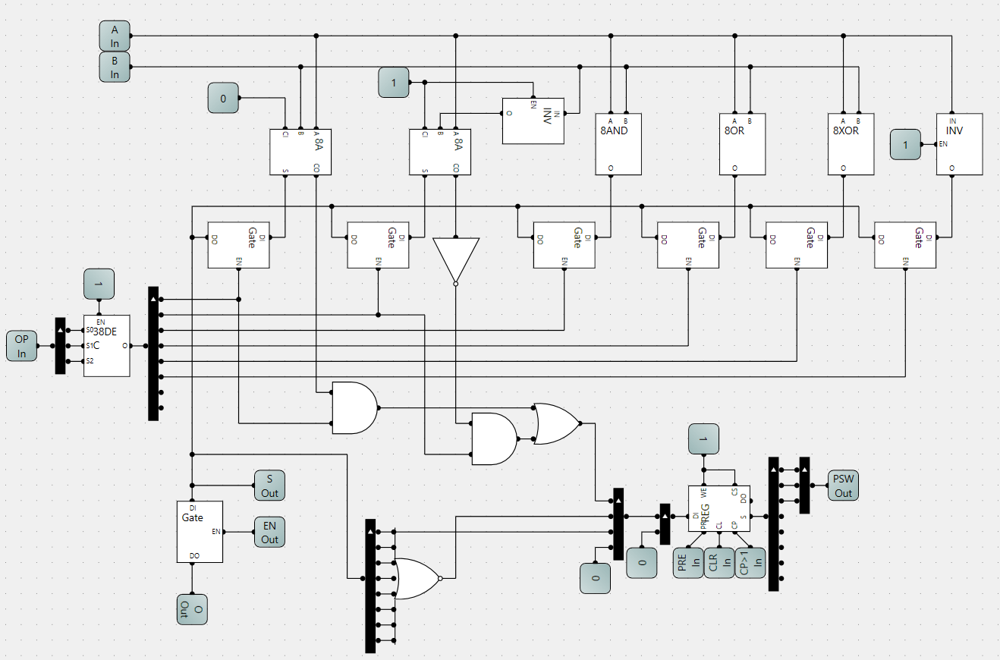