## 基本门电路

### 与门

#### 继电器实现

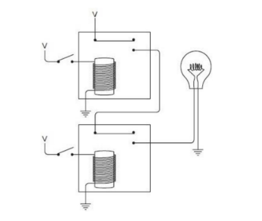

符号表示形式如下：
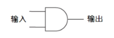

#### 真值表

| AND | 0 | 1 |
| - | - | - |
| 0 | 0 | 0 |
| 1 | 0 | 1 |

### 或门

#### 继电器实现

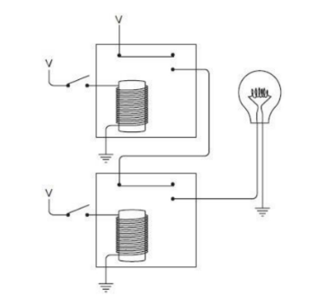

符号表示形式如下：
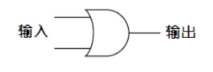

#### 真值表

| OR | 0 | 1 |
| - | - | - |
| 0 | 0 | 1 |
| 1 | 1 | 1 |

### 反相器

#### 继电器实现

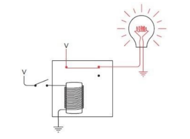

符号表示形式如下：
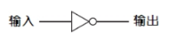

### 或非门

#### 继电器实现

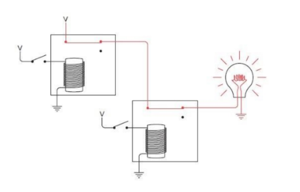

符号表示形式如下：
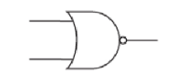

#### 真值表

| NOR | 0 | 1 |
| - | - | - |
| 0 | 1 | 0 |
| 1 | 0 | 0 |

### 与非门

#### 继电器实现

符号表示形式如下：

#### 真值表

| NAND | 0 | 1 |
| - | - | - |
| 0 | 1 | 1 |
| 1 | 1 | 0 |

### 四种不同逻辑门关系如下
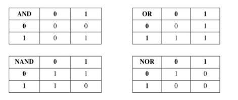

### 摩根定律可以简单地表示为如下形式：

$$
\begin{align*}
    \overline{A} \times \overline{B} &= \overline{A+B} \\
    \overline{A} +      \overline{B} &= \overline{A \times B} 
\end{align*}
$$

## 二进制加法器

一对二进制数相加的结果中具有两个数码，其中一位叫做加法位（sum bit），另一位则叫做进位位（carry bit，例如，1加1等于0，进位为1）

- 表示加法的表格：

    |+加法|0|1|
    |-|-|-|
    |0|0|1|
    |1|1|0|

- 表示进位的表格：

    |+进位|0|1|
    |-|-|-|
    |0|0|0|
    |1|0|1| 

### 异或门

符号表示形式如下：
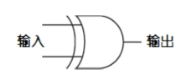
电路图如下：
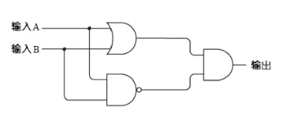

#### 电路实现
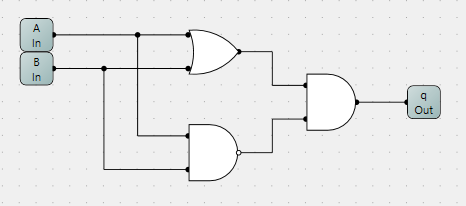

### 半加器

符号表示形式如下：
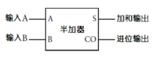
电路图如下：
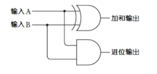

#### 电路实现
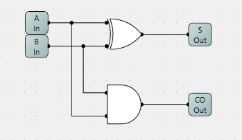

### 全加器

符号表示形式如下：
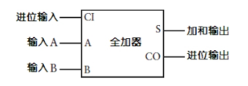
电路图如下：
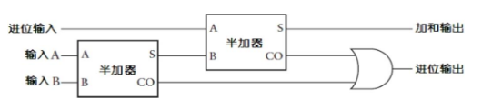

#### 电路实现
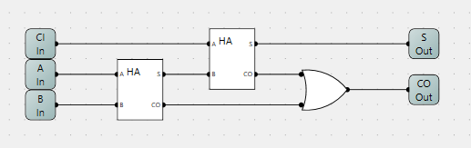

以下表格总结了全加法器所有可能的输入组合以及对应的输出结果。

|输入A|输入B|进位输出|加和输出|进位输出|
|-|-|-|-|-|
|0|0|0|0|0|
|0|1|0|1|0|
|1|0|0|1|0|
|1|1|0|0|1|
|0|0|1|1|0|
|0|1|1|0|1|
|1|0|1|0|1|
|1|1|1|1|1|

### 8位行波进位（ripple carry）全加器

电路图如下：
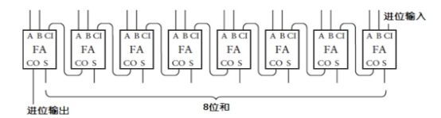

#### 电路实现
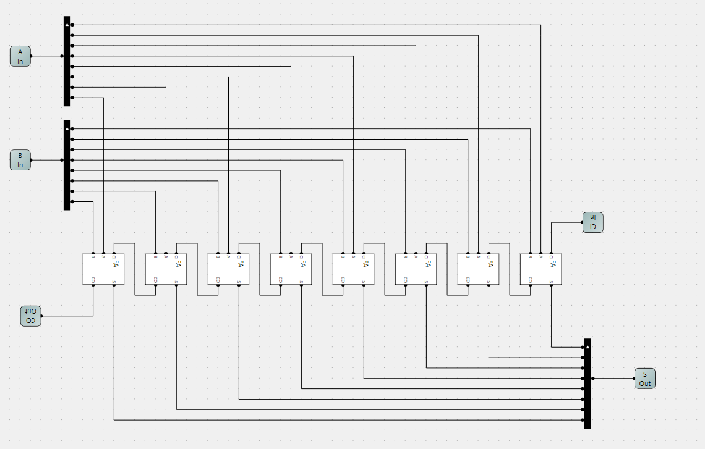

## 如何实现减法

### 求补器

符号表示形式如下：
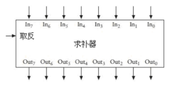
电路图如下：
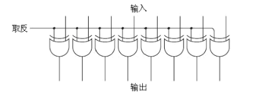

#### 电路实现
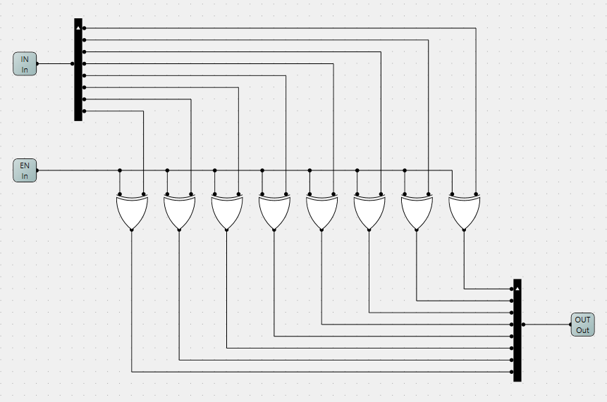

### 减法电路实现
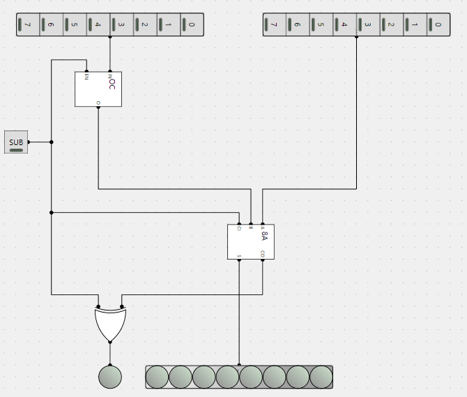

## 触发器

### R-S触发器
电路图如下：

#### 电路实现
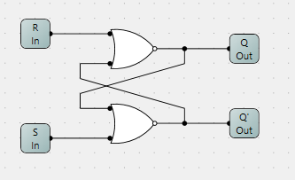

#### R-S触发器真值表

| 输入 | 输入 | 输出 | 输出 |
|------|------|------|------|
| **S** | **R** | **Q** | **Q̅** |
| 1    | 0    | 1    | 0    |
| 0    | 1    | 0    | 1    |
| 0    | 0    | Q    | Q̅   |
| 1    | 1    | 禁止 | 禁止 |

### 具有保持位的R-S触发器
电路图如下：
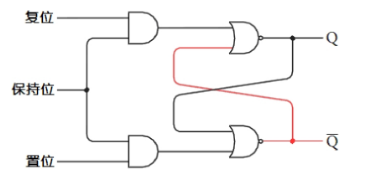

#### 电路实现
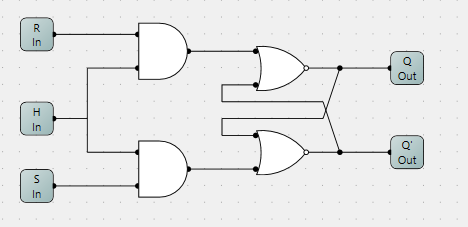

#### 具有保持位R-S触发器真值表

| **数据** | **保持位** | **Q** |
|------|------|------|
| 0    | 1    | 0    | 
| 1    | 1    | 1    | 
| X    | 0    | Q    |

### 电平触发的D型触发器
电路图如下：
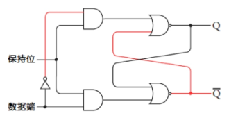

#### 电路实现
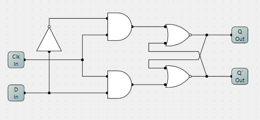

#### 电平触发的D型触发器真值表

| 输入 | 输入 | 输出 | 输出 |
|------|------|------|------|
| **D** | **Clk** | **Q** | **Q̅** |
| 0    | 1    | 0    | 1    |
| 1    | 1    | 1    | 0    |
| X    | 0    | Q    | Q̅   |

### 边沿触发的D型触发器
电路图如下：
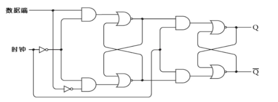

#### 电路实现
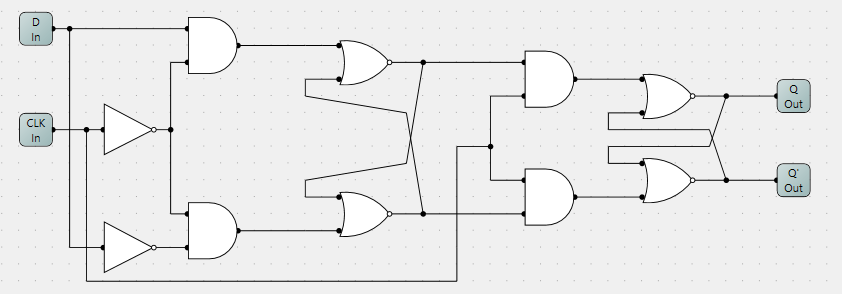

#### 边沿触发的D型触发器真值表

| 输入 | 输入 | 输出 | 输出 |
|------|------|------|------|
| **D** | **Clk** | **Q** | **Q̅** |
| 0    | ↑    | 0    | 1    |
| 1    | ↑    | 1    | 0    |
| X    | 0    | Q    | Q̅    |

#### 边沿触发的D型触发器（带有清除和预设）

#### 电路实现
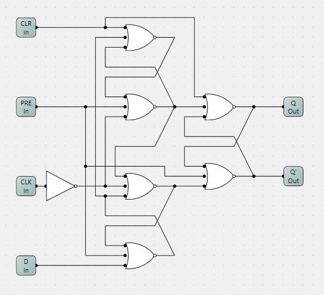

#### 边沿触发的D型触发器真值表

| 输入 | 输入 | 输入 | 输入 | 输出 | 输出 |
|------|------|------|------|------|------|
| **Pre** | **Clr** | **D** | **Clk** | **Q** | **Q̅** |
| 1   | 0   | X    | X    | 1    | 0    |
| 0   | 1   | X    | X    | 0    | 1    |
| 0   | 0   | 0    | ↑    | 0    | 1    |
| 0   | 0   | 1    | ↑    | 1    | 0    |
| 0   | 0   | X    | 0    | Q    | Q̅    |

## 计数器

### 分频器
电路图如下：
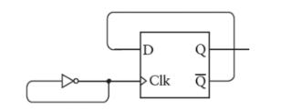

#### 电路实现
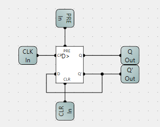

### 8位行波计数器
电路图如下：
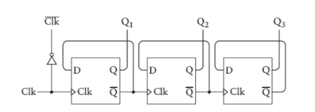

#### 电路实现
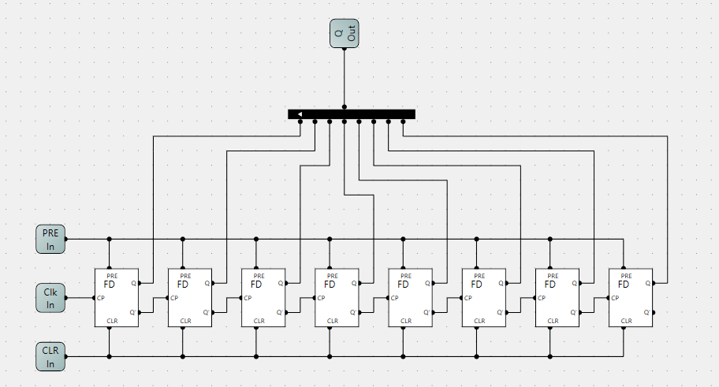

## 寄存器 (edge-triggered）

### 三态门（Three-State Gate）

#### 电路实现
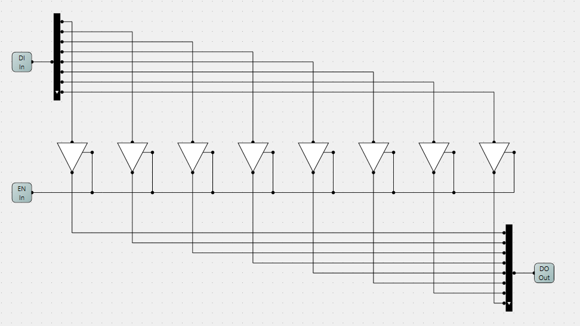

### 8位锁存器
电路图如下：
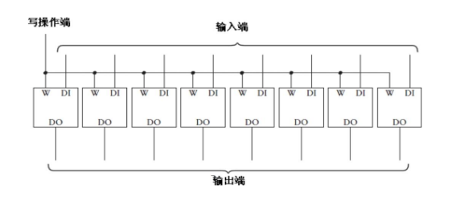

#### 电路实现
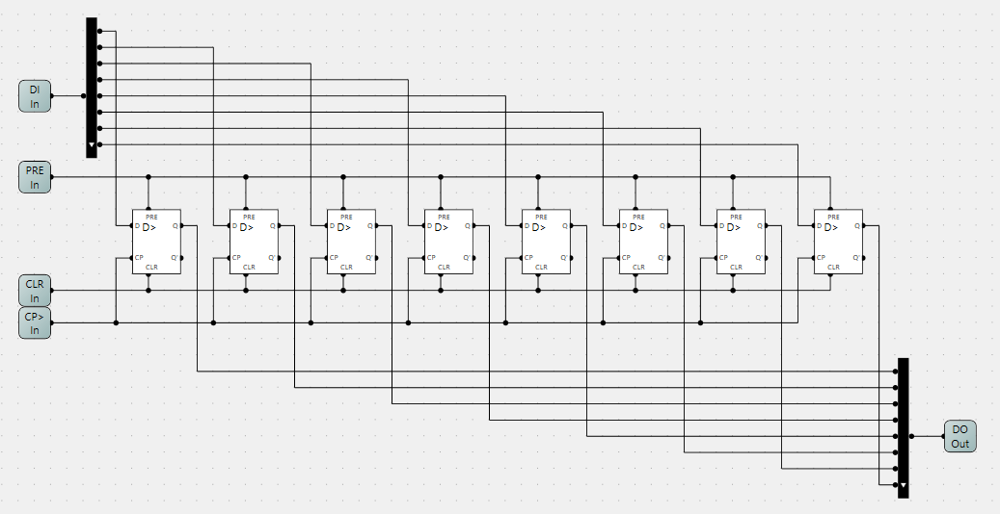

### 8位寄存器

#### 电路实现
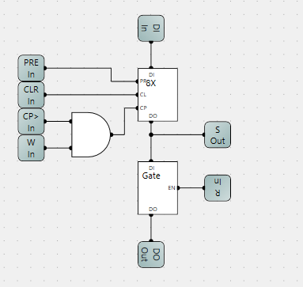